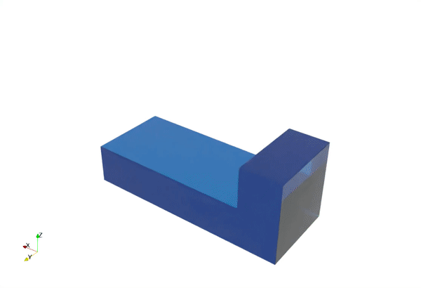

# ***MaterialPointVisualizer*** 

[](https://github.com/LandslideSIM/MaterialPointVisualizer.jl/actions/workflows/ci.yml) 
[](https://LandslideSIM.github.io/MaterialPointVisualizer.jl/stable)
[]()

With this package, we can convert the MPM simulation results (HDF5 files from ***[MaterialPointSolver.jl](https://github.com/LandslideSIM/MaterialPointSolver.jl)*** ) into `.vtp` files or create ParaView-compatible animations. Additionally, it includes some post-processing functionalities.

## Installation ⚙️

Just type <kbd>]</kbd> in Julia's  `REPL`:

```julia
julia> ]
(@1.11) Pkg> add MaterialPointVisualizer
```

## Features ✨

- [x] HDF5 to `.vtp` files
- [x] surface reconstruction (based on [splashsurf](https://github.com/LandslideSIM/MaterialPointSolver.jl))
- [x] fast `vtp` for general particle-based results
- [x] surface detection

## Showcases 🎲

| ParaView |  Surface reconstruction |
|:--------:|:--------:|
|  |  |

## Acknowledgement 👍

This project is sponserd by [Risk Group | Université de Lausanne](https://wp.unil.ch/risk/) and [China Scholarship Council [中国国家留学基金管理委员会]](https://www.csc.edu.cn/).