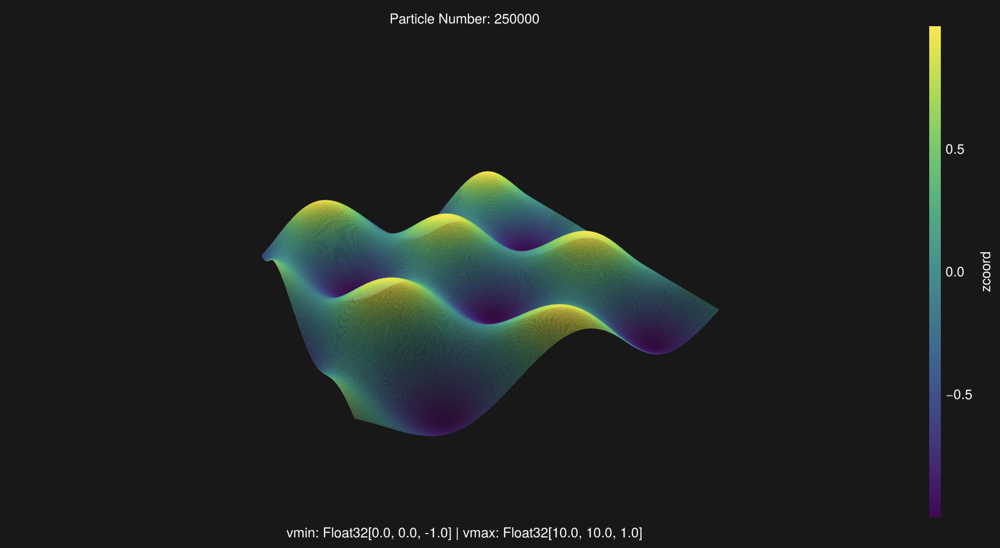

# GUI

!!! info

    Sometimes we already have data in Julia and just want to see the results without exporting it to other software for visualization, which is too troublesome...😢

We implemented a high-performance rapid visualization solution using [Three.js](https://threejs.org), allowing you to quickly and smoothly view millions of particles (at least on my laptop). However, sometimes we connect to a remote headless server for calculations via SSH, and at this point, we also support quickly viewing the results through your local browser.

!!! warning

    If your data is large on a remote server, such as over a million, then you need to wait for the data to be transferred locally. We use a binary file for saving. During this process, the web page content is blank.

## Example

Assuming we visualize locally (GUI) and use the particles' ``x`` and ``z`` coordinates as two attributes of the vertices for coloring:

```julia
using MaterialPointGenerator # generate particles
using MaterialPointVisualizer

n = 500
xy = meshbuilder(range(1, 10, length=n), range(1, 10, length=n)) # x, y coordinates
z = @. sin(xy[:, 1]) + cos(xy[:, 2]) # z coordinates

coords = hcat(xy, z) # vertices
attr = (xcoord=coords[:, 1], zcoord=coords[:, 3]) # vertices' attibutes

vispts(coords, colormap="viridis", attrs=attr, gui=true)
```

If everything is fine, you should now see a separate window displaying the particles. If `gui=false`, then the Julia REPL should print an address for you to check in your browser.



I personally believe that for visualizations with more than 3,600,000 particles, the human eye may not be able to discern differences, so this is the default threshold, but you can change it freely.

!!! note

    1) On the touchpad, a two-finger press and move is panning.
    2) If the input method is not in English when the GUI is opened, the Julia REPL may print some information; please ignore it.

!!! warning

    - If you use `gui=true` on a headless server, it will throw an error. In other words, the remote server must use a website approach.
    - Although the Julia VSCode extension has a plot panel, I don't want to use it. Opening a browser should be sufficient. I guess everyone has at least one modern browser on their computer. 😝

Many args are not required, please check:

```@docs
vispts(
    coord   ::Matrix;
    colormap::String    ="viridis", 
    attrs   ::NamedTuple=NamedTuple(), 
    gui     ::Bool      =false,
    sample_n::Int       =3600000
)
```