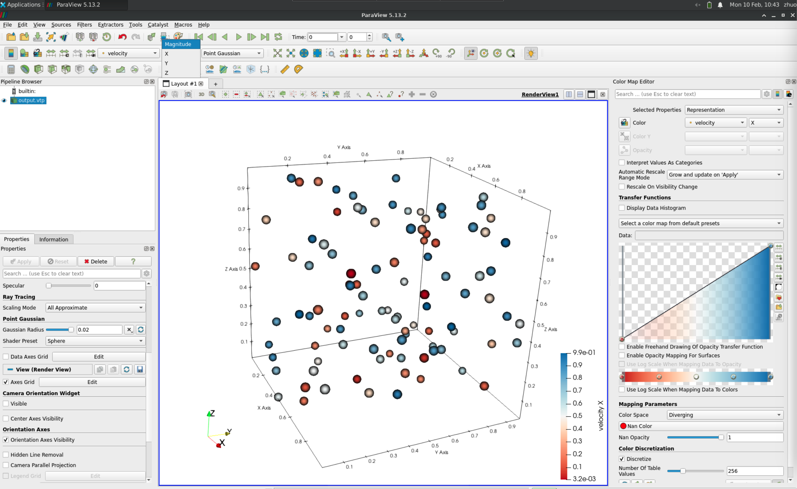

# Particle to .vtp file

No matter how your particle data is stored, we only need you to convert it into a regular 2D array in Julia, where the number of rows represents the number of particles, and the number of columns is 2 (for 2D) or 3 (for 3D).

```@docs
fastvtp(coords; vtp_file="output.vtp", data::T=NamedTuple()) where T <: NamedTuple
```

## Array particle to `.vtp`

```julia
particle_data = rand(100, 3)
vtpfile = joinpath(@__DIR__, "test.vtp")

fastvtp(particle_data, vtp_file=vtpfile)
```

## Add particle properties

```julia
particle_num = 100
particle_data = rand(particle_num, 3)
velocity = rand(particle_num, 3) # x, y, z
scalar = rand(particle_num)

vtpfile = joinpath(@__DIR__, "test.vtp")

fastvtp(particle_data, vtp_file=vtpfile, data=(velocity=velocity, scalar=scalar))
```

!!! note

    If there is only one property, do not forget there should be a `,`

```julia
fastvtp(particle_data, vtp_file=vtpfile, data=(scalar=scalar,))
```

